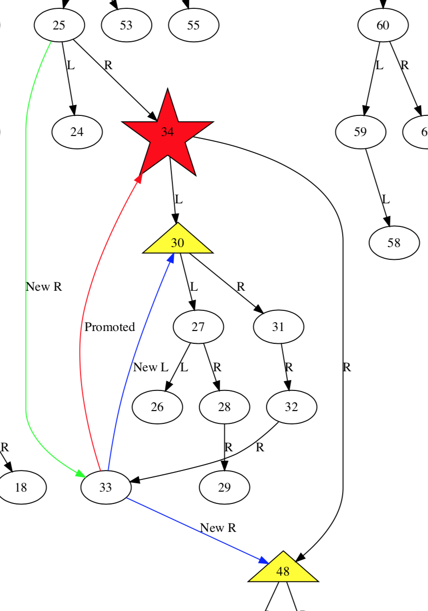

# Demonstrate a Binary Search Tree Graphically

## Motivation

When trying to test whether you've managed to figure out an algorithm's
implementation, it's darn difficult to judge using standard console output
tools. Here's a template for generating source files that can be used to
visually validate that you're code Did The Right Thing.

## Generate A Directed Graph File

npm -s run dev > simple.dot

## ...And turn it into a PDF

`dot -Tpdf -o simple.pdf simple.dot`

## ...And View It

`open -a "Preview" simple.pdf`

## All-In-One

`npm -s run dev > simple.dot && dot -Tpdf -o simple.pdf simple.dot && open -a "Preview" simple.pdf`
